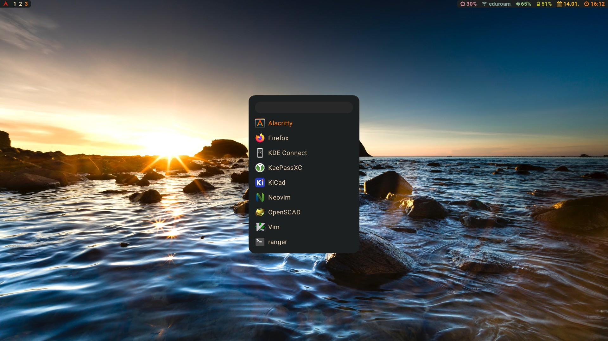
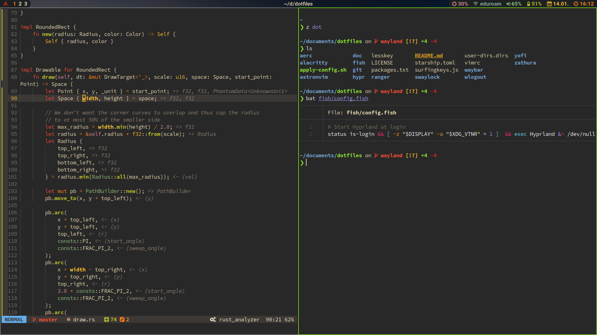
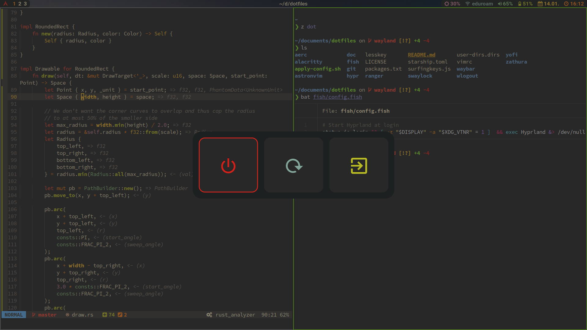

# Dotfiles

This repository contains configuration files for most of the programs I use.

## General setup

#### Keyboard

- Hardware: [Concavum](https://github.com/julianschuler/keyboards/tree/master/concavum), custom designed ergonomic keyboard
- Layout: [modified VOU layout](https://github.com/julianschuler/keyboards/blob/master/concavum/qmk/keymaps/julianschuler/keymap.c#L51) (optimized for German and English)

#### General

- Operating system: [Arch Linux](https://archlinux.org/)
- Package manager: [Paru](https://github.com/morganamilo/paru)
- Editor: [Neovim](https://github.com/neovim/neovim) using [AstroNvim](https://github.com/AstroNvim/AstroNvim) as base config
- Font: [Source Code Pro Nerd Font](https://github.com/ryanoasis/nerd-fonts/tree/master/patched-fonts/SourceCodePro)

#### Terminal

- Terminal emulator: [Alacritty](https://alacritty.org/)
- Shell: [fish](https://github.com/fish-shell/fish-shell)
- Prompt: [starship](https://github.com/starship/starship)
- File manager: [ranger](https://github.com/ranger/ranger)
- Smart directory switching: [zoxide](https://github.com/ajeetdsouza/zoxide)
- Cat with syntax highlighting: [bat](https://github.com/sharkdp/bat)
- Faster grep alternative: [ripgrep](https://github.com/BurntSushi/ripgrep)
- Improved diffs: [delta](https://github.com/dandavison/delta)
- Fuzzy finder: [fzf](https://github.com/junegunn/fzf)
- Improved ls: [exa](https://github.com/ogham/exa)

#### Browser

- Browser: [Firefox](https://www.mozilla.org/de/firefox/new)
- Addons: [Surfingkeys](https://github.com/brookhong/Surfingkeys), [Dark Reader](https://github.com/darkreader/darkreader)

#### Desktop

- Wayland compositor: [Hyprland](https://github.com/hyprwm/Hyprland)
- Status bar: [waybar](https://github.com/Alexays/Waybar)
- Application launcher: [yofi](https://github.com/l4l/yofi)
- Screen locker: [swaylock-effects](https://github.com/jirutka/swaylock-effects)
- Power menu: [wlogout](https://github.com/ArtsyMacaw/wlogout)
- Email client: [aerc](https://git.sr.ht/~rjarry/aerc)
- PDF viewer: [zathura](https://pwmt.org/projects/zathura)
- Password manager: [KeePassXC](https://keepassxc.org)

## Applying the configuration

The provided script `apply-config.sh` can be used to apply some or all parts of the configuration. See `apply-config.sh -h` for further information.

## Screenshots

## License

This repository is licensed under the MIT license, see [`LICENSE.txt`](LICENSE.txt) for further information.
